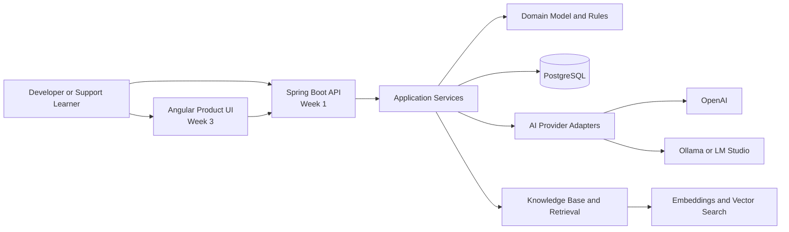

# AI Helpdesk Mentor

Build an AI helpdesk product while learning modern software engineering.

AI Helpdesk Mentor is a staged learning project that teaches you how to design and build an AI-assisted support platform with Spring Boot, PostgreSQL, retrieval concepts, and a future Angular product UI. It is designed to feel like a real product journey rather than a toy tutorial: you learn architecture, APIs, persistence, AI orchestration, and product thinking by building something that could grow into a real internal support tool.

This repository currently acts as the public documentation and learning hub for the project. The `main` branch is docs-first and roadmap-driven. Implementation is intended to be delivered in staged solution branches so learners can study the architecture before jumping straight into code.

## Why this project

Most beginner AI projects skip the parts that matter in real products: clean architecture, validation, data modeling, error handling, fallback behavior, operational concerns, and clear tradeoffs between hosted and local models.

This project takes the opposite approach. You build an AI triage platform the same way a small product team would:

- Start with a solid backend foundation.
- Add an AI intelligence layer with safe fallbacks.
- Evolve into a product UI and learning experience.
- Keep the design extensible for retrieval, feedback loops, and future multi-user support.

## Who this is for

- Beginner developers who want a structured, realistic project.
- Backend learners exploring Spring Boot and layered architecture.
- AI application learners who want more than a single prompt demo.
- Developers who want to understand how AI features fit into a real product.
- Educators, mentors, and self-learners looking for a guided build path.

## What you will build

AI Helpdesk Mentor is an AI-assisted support workflow with room to grow into a full product.

Planned product capabilities include:

- Ticket intake and lifecycle management.
- AI-generated summary, category, priority, and suggested response.
- Provider abstraction for OpenAI, local models, and future model backends.
- Knowledge base ingestion and retrieval foundations.
- Retrieval-augmented helpdesk and mentoring workflows.
- A future Angular UI with dashboards, ticket views, and an AI mentor panel.
- Feedback-driven improvement loops for AI behavior.

## Current repository status

This repository is intentionally staged.

- Implemented in `main`: public documentation, architecture guidance, learning path, setup notes, roadmap, and solution-branch planning.
- Planned through solution branches: backend implementation, AI orchestration, frontend product UI, and end-to-end runnable demos.
- Planned after core learning milestones: gamification, enterprise mode, authentication, multi-user support, deployment hardening, and product polish.

If you want a runnable codebase, follow the solution branches documented in [SOLUTION_BRANCHES.md](SOLUTION_BRANCHES.md).

## Key features

### Implemented in the learning materials

- Clean architecture guidance: API, application, domain, infrastructure.
- Week-by-week project path for backend, AI, and frontend stages.
- Environment and tooling guidance for Java, Docker, PostgreSQL, and AI configuration.
- Architecture documentation, diagrams, and staged learning notes.

### Planned in the product implementation

- Spring Boot REST API for ticket creation, retrieval, triage, and workflow status updates.
- PostgreSQL persistence with Flyway migrations.
- Problem+json error responses and validation.
- Deterministic AI triage output with fallback behavior.
- Optional OpenAI and local model adapters.
- Knowledge base ingestion, chunking, embeddings, and retrieval concepts.
- Angular dashboard and AI mentor experience.

## Architecture overview

The project follows a layered, product-oriented architecture.

Architecture principles:

- Controllers stay thin and handle HTTP mapping only.
- Application services orchestrate workflows.
- Domain rules stay framework-free where possible.
- Infrastructure adapters isolate databases and model providers.
- AI behavior degrades safely when providers fail.

For the full architecture guide, see [docs/architecture.md](docs/architecture.md).

## Learning roadmap

### Week 1: Functional backend foundation

- Spring Boot
- REST API
- JPA
- Flyway
- PostgreSQL
- validation
- problem+json errors
- tests
- Docker support

### Week 2: AI intelligence layer

- ticket classification
- summarization
- severity suggestion
- AI provider abstraction
- OpenAI adapter
- optional local model support
- knowledge base foundations
- retrieval augmented generation concepts
- feedback learning loop

### Week 3: Frontend product UI

- Angular application
- ticket dashboard
- ticket detail page
- AI mentor panel
- knowledge base admin UI
- learner progress dashboard

### Future roadmap

- gamification
- badges
- streaks
- challenge tickets
- enterprise support mode
- authentication
- multi-user support
- deployment

## Tech stack

### Backend

- Java 21
- Spring Boot 3.x
- Spring Web
- Spring Validation
- Spring Data JPA
- Flyway
- PostgreSQL
- pgvector as the preferred vector path
- OpenAPI / Swagger
- JUnit 5
- Testcontainers

### AI and retrieval

- OpenAI for hosted model access
- local HTTP model support for Ollama, LM Studio, or similar tools
- provider abstraction for future model integrations
- embeddings and retrieval concepts for RAG-style support flows

### Frontend

- Angular for the planned product UI

### Developer workflow

- Docker and docker compose
- Maven
- optional Node.js and Angular CLI

## Quick start

The `main` branch is documentation-first. To run implementation code, use one of the staged solution branches when available.

1. Read [QUICKSTART.md](QUICKSTART.md) for the fastest path.
2. Read [INSTALLATION.md](INSTALLATION.md) if you need full setup guidance.
3. Review [WEEK1_GUIDE.md](WEEK1_GUIDE.md), [WEEK2_GUIDE.md](WEEK2_GUIDE.md), and [WEEK3_GUIDE.md](WEEK3_GUIDE.md) to understand the staged build.
4. Use [SOLUTION_BRANCHES.md](SOLUTION_BRANCHES.md) to choose the right implementation milestone.

## Screenshots

Screenshots will be added as the product UI and backend demo assets land.

- Product landing or dashboard screenshot: coming with Week 3.
- Ticket detail plus AI mentor panel screenshot: coming with Week 3.
- API flow and triage demo images: planned with the runnable solution branches.

## Solution branches

This project is designed around staged learning branches.

- `solutions-week1`: backend foundation
- `solutions-week2`: AI triage layer
- `solution-week3`: planned public branch for frontend product UI
- `solution-complete`: planned public branch for the full product walkthrough

The repository currently exposes `solutions-week1`, `solutions-week2`, and `solutions-stretch`. The public-facing naming will expand as Week 3 and the complete product branch are published.

Details are in [SOLUTION_BRANCHES.md](SOLUTION_BRANCHES.md).

## Documentation map

- [QUICKSTART.md](QUICKSTART.md)
- [INSTALLATION.md](INSTALLATION.md)
- [WEEK1_GUIDE.md](WEEK1_GUIDE.md)
- [WEEK2_GUIDE.md](WEEK2_GUIDE.md)
- [WEEK3_GUIDE.md](WEEK3_GUIDE.md)
- [docs/architecture.md](docs/architecture.md)
- [docs/AI_ARCHITECTURE.md](docs/AI_ARCHITECTURE.md)
- [docs/API_REFERENCE.md](docs/API_REFERENCE.md)
- [docs/KNOWLEDGE_BASE.md](docs/KNOWLEDGE_BASE.md)
- [TROUBLESHOOTING.md](TROUBLESHOOTING.md)
- [FAQ.md](FAQ.md)

## Contributing

Contributions are welcome in three areas:

- improving documentation clarity and accuracy
- refining the staged learning experience
- adding implementation branches and demos that match the documented architecture

Before opening a change:

1. Keep docs clear about what is implemented versus planned.
2. Prefer architecture-first explanations over framework-first shortcuts.
3. Keep beginner guidance accurate without hiding real engineering tradeoffs.
4. Avoid introducing business logic drift between docs and solution branches.

## Public roadmap

Near-term:

- publish polished Week 1 backend implementation branch
- publish Week 2 AI triage implementation branch
- add branch strategy for Week 3 Angular UI
- add demo assets and screenshots

Later:

- add knowledge base ingestion workflows
- ship AI mentor and learner progress experiences
- support local-first and hosted model paths equally well
- add deployment and production-readiness tracks

## License and usage

Add the project license and contribution policy that fit your intended public release before distributing the project broadly.

