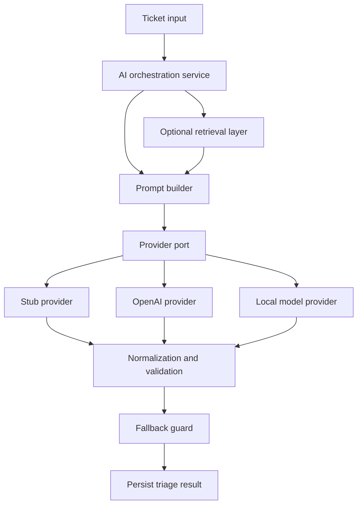

# AI Architecture

This document explains how the AI subsystem should be designed for AI Helpdesk Mentor.

## Goals

The AI architecture should:

- produce structured triage output
- support more than one model provider
- remain testable without external APIs
- support safe fallback behavior
- leave room for retrieval and grounded explanations

## AI orchestration

The backend should not call a model provider directly from the controller. AI work belongs in an orchestrated application flow.

Typical orchestration steps:

1. load the ticket
2. decide whether triage should run or return an existing result
3. build the prompt or structured request
4. select the configured provider
5. normalize and validate the response
6. apply fallback behavior if needed
7. persist the final triage result

## Model provider abstraction

The application should depend on a provider-neutral port.

Typical provider options:

- stub provider for local development and tests
- OpenAI provider for hosted inference
- local HTTP provider for Ollama, LM Studio, or similar runtimes
- future providers such as Anthropic

This keeps business logic independent from vendor-specific request and response shapes.

## Prompt execution

Prompt execution should be treated like an explicit application concern.

Good design properties:

- prompts are versionable
- output format is constrained
- prompt templates are understandable by humans
- provider adapters handle provider-specific serialization details

The goal is not to hide prompting. The goal is to keep it manageable.

## Retrieval integration

The AI layer should be able to run in two modes.

### Direct triage mode

The model classifies and summarizes the ticket directly.

### Retrieval-augmented mode

The system retrieves relevant knowledge chunks first, then grounds the prompt with that context.

This creates a path toward better explanations, support recommendations, and future mentor workflows.

## Fallback logic

Fallback behavior is required, not optional.

Fallback should trigger when:

- the provider is unavailable
- credentials are missing
- the response is invalid
- the provider returns content that cannot be normalized safely

Safe fallback output:

- category `OTHER`
- priority `P3`
- confidence `0.0`
- a short summary indicating limited AI confidence if appropriate

## Confidence scoring

Confidence is a product signal, not a proof.

It should be used to:

- surface low-confidence triage for review
- guide UI emphasis and human escalation
- support future analytics and evaluation

It should not be presented as exact scientific certainty.

## Response generation

The AI subsystem may produce multiple output types over time.

Current target outputs:

- summary
- category
- priority
- confidence
- suggested response

Future output types:

- root-cause explanation
- beginner explanation for learners
- grounded resolution suggestions
- mentor-style coaching content

## AI architecture diagram

## Implementation status

- The design is documented on `main`.
- The AI implementation itself is expected in the Week 2 solution branch.