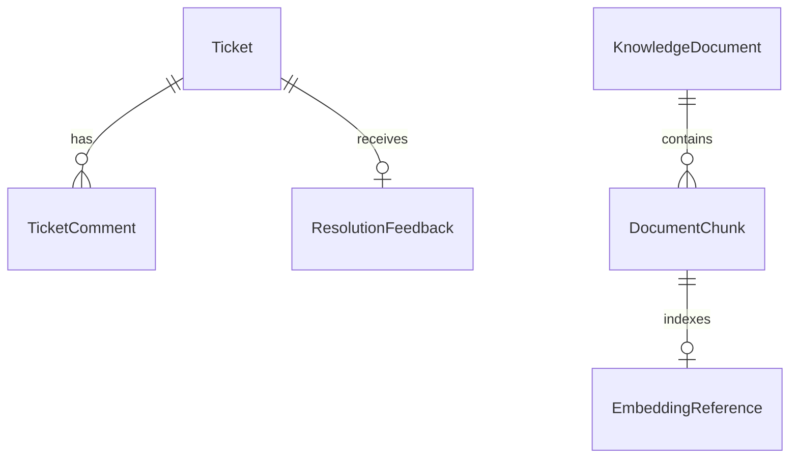

# Data Model

This document describes the target data model for AI Helpdesk Mentor. Some entities are part of the early backend milestones, while others are planned for retrieval, feedback, and learner-product features.

## Entity overview

### Ticket

Represents a support issue submitted into the system.

Core fields:

- `id`
- `subject`
- `description`
- `customerEmail`
- `status`
- `createdAt`
- `updatedAt`

Purpose:

- the core aggregate of the backend
- the source input for AI triage and future retrieval flows

### TicketComment

Represents a human or system comment attached to a ticket.

Possible fields:

- `id`
- `ticketId`
- `authorType`
- `authorName`
- `content`
- `createdAt`

Purpose:

- support conversational workflows
- record internal notes or mentor explanations
- support future multi-user collaboration

### KnowledgeDocument

Represents a source document ingested into the knowledge base.

Possible fields:

- `id`
- `title`
- `sourceType`
- `sourcePath`
- `contentType`
- `status`
- `createdAt`
- `updatedAt`

Purpose:

- track source material for retrieval and grounding

### DocumentChunk

Represents a retrievable unit derived from a knowledge document.

Possible fields:

- `id`
- `documentId`
- `chunkIndex`
- `content`
- `tokenCount`
- `metadataJson`
- `createdAt`

Purpose:

- support chunk-level retrieval
- preserve chunk ordering and metadata

### EmbeddingReference

Represents the stored vector or fallback retrieval key tied to a chunk or ticket.

Possible fields:

- `id`
- `ownerType`
- `ownerId`
- `provider`
- `model`
- `vectorDimension`
- `embeddingKey`
- `createdAt`

Purpose:

- support vector search and traceability
- let the system evolve even if embedding storage strategy changes

### ResolutionFeedback

Represents human feedback on AI-generated triage or support suggestions.

Possible fields:

- `id`
- `ticketId`
- `triageVersion`
- `accepted`
- `correctedCategory`
- `correctedPriority`
- `feedbackNotes`
- `createdAt`

Purpose:

- capture the feedback loop for prompt and evaluation improvements

### UserProgress

Represents learner-facing product progress.

Possible fields:

- `id`
- `userId`
- `ticketsCompleted`
- `streakDays`
- `badgesJson`
- `lastActivityAt`
- `createdAt`
- `updatedAt`

Purpose:

- power the future learner dashboard and gamification features

## Relationship model

Additional conceptual relationships:

- a `Ticket` may eventually reference many retrieval matches from `DocumentChunk`
- a `Ticket` may have one current triage result per versioned AI execution
- a `UserProgress` record may summarize work performed across many tickets

## Early milestone data model

Expected in the early staged implementation:

- `Ticket`
- `TriageResult` as an implementation detail of Week 2

Planned for later milestones:

- `TicketComment`
- `KnowledgeDocument`
- `DocumentChunk`
- `EmbeddingReference`
- `ResolutionFeedback`
- `UserProgress`

## Design notes

- Prefer UUIDs generated in the application.
- Keep timestamps explicit for auditability.
- Use relational tables for transactional truth.
- Use vector storage as an augmentation, not the primary system of record.