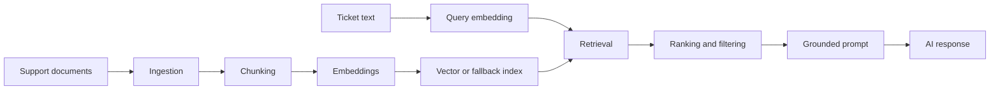

# Knowledge Base

The knowledge base is the subsystem that turns AI Helpdesk Mentor from a pure classifier into a grounded support and learning platform.

## Why the knowledge base matters

Without a knowledge base, the AI mostly relies on its general training and the current ticket text. With a knowledge base, the system can retrieve relevant internal context such as troubleshooting guides, runbooks, support notes, and product documentation.

That enables:

- grounded suggestions
- more reliable mentor explanations
- retrieval-augmented generation workflows
- explainable support assistance

## Ingestion

The ingestion pipeline should accept useful support material such as:

- markdown guides
- PDFs
- troubleshooting documents
- product support notes
- API documentation

Ingestion responsibilities:

- identify the source
- normalize content into text
- store source metadata
- schedule chunking and indexing

## Chunking

Chunking breaks large documents into retrieval-friendly pieces.

Good chunking balances:

- enough context to be useful
- small enough units to retrieve precisely
- metadata that preserves source traceability

Typical metadata:

- document ID
- chunk index
- title or section
- source type
- tags

## Embeddings

Embeddings convert text chunks into vectors so the system can compare semantic similarity.

Embedding strategy considerations:

- choose one embedding model per index where possible
- store model and dimension metadata
- re-index when the embedding strategy changes

## Metadata

Metadata improves retrieval quality and operational control.

Useful metadata fields:

- product area
- issue type
- platform
- source document type
- freshness or version

## Retrieval

Retrieval should support both direct support workflows and learning workflows.

Example retrieval use cases:

- find similar troubleshooting steps for a ticket
- pull internal guidance for a suggested response
- provide grounded context for the AI mentor panel

## Ranking

Vector similarity alone is often not enough.

A stronger retrieval path can combine:

- vector similarity
- metadata filtering
- lexical matching
- heuristic reranking

## RAG flow

## Implementation status

- knowledge base concepts are documented now
- full ingestion and retrieval workflows are planned extensions beyond the current docs-first `main` branch