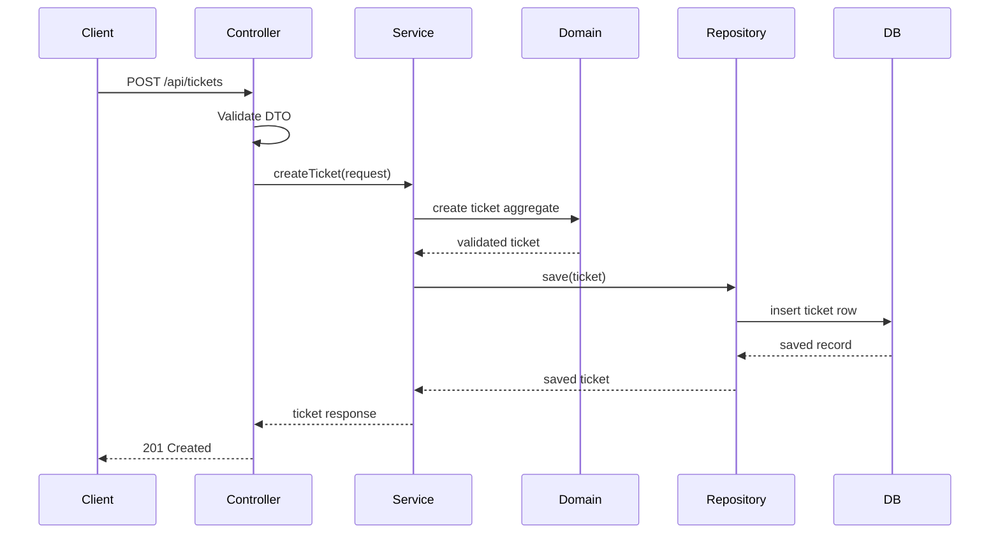
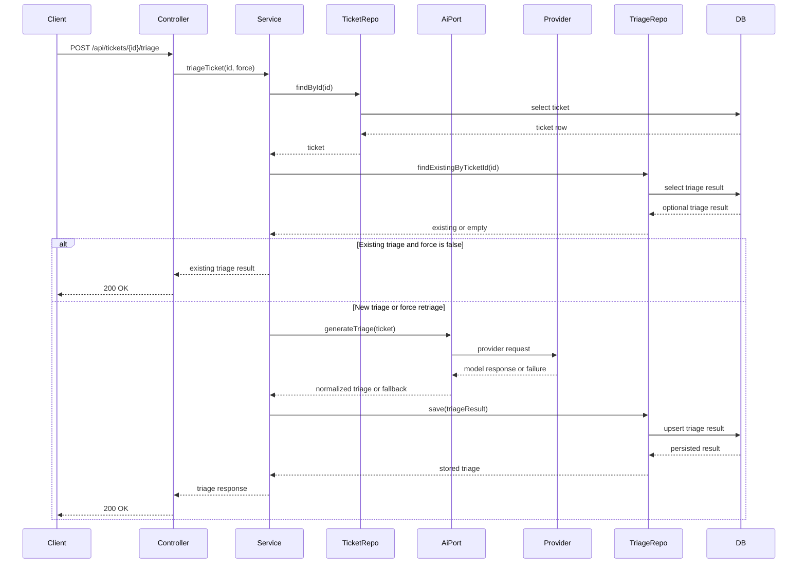
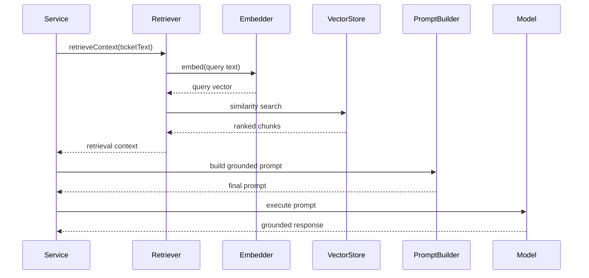
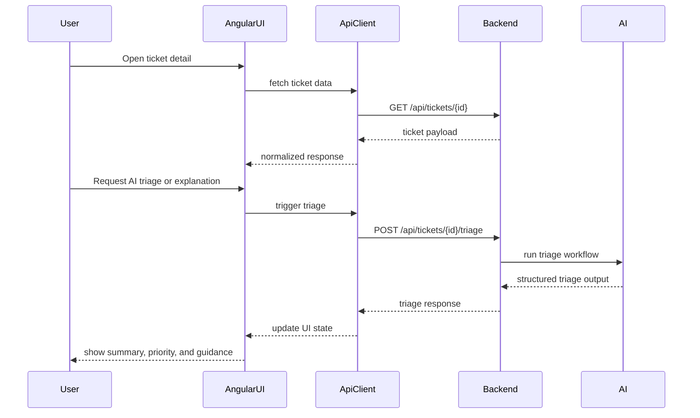

# Sequence Diagrams

These diagrams describe the target runtime flows for the staged implementation. They are useful both for architecture review and for teaching how requests move through the system.

## Ticket creation flow

## AI triage flow

## Knowledge base retrieval flow

## Frontend interaction flow

