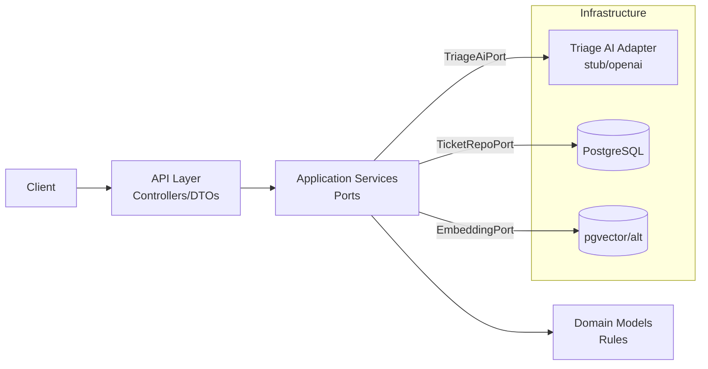

# Architecture Overview

## Layers
- API: REST controllers/DTOs; map HTTP <-> application requests; no business logic.
- Application: services orchestrating flows; ports for AI, persistence, embeddings; enforces status transitions.
- Domain: pure Java models and rules; no Spring annotations.
- Infrastructure: adapters for JPA repositories, AI client (stub/OpenAI), optional embeddings (pgvector or alt), config.

## Data + Persistence
- PostgreSQL primary store (recommended); Flyway for schema migrations.
- Tables: tickets (uuid PK, subject, description, customer_email, status, created_at, updated_at); triage_results (ticket_id FK unique, summary, category, priority, confidence, model, created_at); optional embeddings table (ticket_id, vector or fingerprint).
- Use Spring Data JPA; Testcontainers for integration tests.

## AI Integration
- Application port `TriageAiPort` returns deterministic triage result (summary <=500 chars, category enum, priority enum, confidence 0..1, optional suggestedResponse).
- Infra adapters: stub (default) and OpenAI (env-driven); safe fallback on failure (OTHER, P3, 0.0).

## Error Handling & Validation
- Bean Validation on DTOs (subject 5-120, description 20-4000, customerEmail valid email).
- Global exception handler returning problem+json-style responses; avoid leaking secrets or full ticket text.

## Observability
- Structured logging (slf4j); request logging filter; optional actuator metrics if desired.

## Config & Secrets
- `application.yml` for non-secrets; env vars for secrets: `DB_URL`, `DB_USER`, `DB_PASS`, `OPENAI_API_KEY`, `TRIAGE_AI_MODE=stub|openai`.

## Packaging Suggestion
- `com.example.tickettriage.api` (controllers, dtos)
- `com.example.tickettriage.application` (services, ports)
- `com.example.tickettriage.domain` (models, rules)
- `com.example.tickettriage.infrastructure` (persistence, ai, config)

## High-Level Diagram

