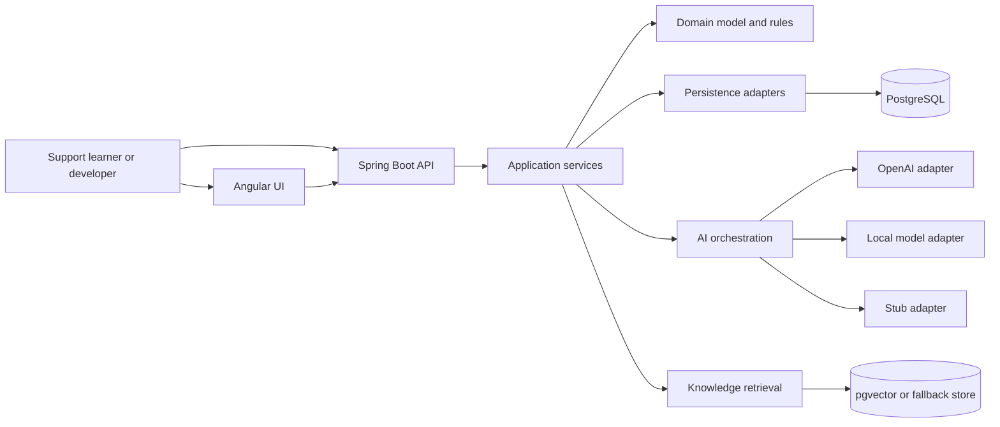
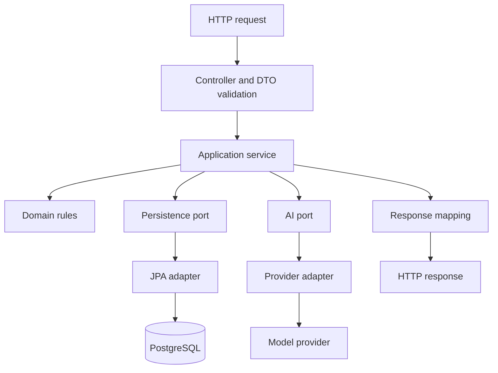

# Architecture

AI Helpdesk Mentor is designed as both a real product blueprint and a teaching project. The architecture is intentionally layered so beginners can learn clean boundaries early, while still leaving room for AI orchestration, retrieval, and a future frontend experience.

## Implementation status

- `main` currently contains the public documentation and learning structure.
- The architecture below describes the target product shape for the staged implementation branches.
- Week 1 focuses on the backend foundation.
- Week 2 adds the AI orchestration layer.
- Week 3 adds the Angular product UI.

## High-level system architecture

```mermaid
flowchart LR
  User[Support learner or developer] --> UI[Angular UI]
  User --> API[Spring Boot API]
  UI --> API
  API --> APP[Application services]
  APP --> DOMAIN[Domain model and rules]
  APP --> PERSIST[Persistence adapters]
  APP --> AI[AI orchestration]
  APP --> KB[Knowledge retrieval]
  PERSIST --> PG[(PostgreSQL)]
  KB --> VEC[(pgvector or fallback store)]
  AI --> OPENAI[OpenAI adapter]
  AI --> LOCAL[Local model adapter]
  AI --> STUB[Stub adapter]
```

## Backend architecture

The backend is organized into four primary layers.

### API layer

Responsibilities:

- expose REST endpoints
- map requests and responses with DTOs
- apply input validation
- translate exceptions into problem+json responses

What should not live here:

- business rules
- AI orchestration logic
- persistence logic

### Application layer

Responsibilities:

- orchestrate use cases
- coordinate domain logic and infrastructure ports
- manage feature flags and conditional workflows
- decide when to trigger AI or retrieval flows

Typical services:

- create ticket
- get ticket
- list tickets
- update status
- triage ticket
- retrieve similar tickets or knowledge context

### Domain layer

Responsibilities:

- represent the core business model
- enforce ticket status transitions
- keep core rules independent from Spring and persistence details

Typical domain concerns:

- ticket lifecycle rules
- category and priority enums
- confidence constraints
- feedback semantics

### Infrastructure layer

Responsibilities:

- JPA entities and repositories
- database adapters
- OpenAI and local model adapters
- embeddings or vector storage adapters
- application configuration and runtime wiring

## Backend package model

Recommended packages:

- `com.example.tickettriage.api`
- `com.example.tickettriage.application`
- `com.example.tickettriage.domain`
- `com.example.tickettriage.infrastructure`

This structure keeps product concerns aligned with architectural roles.

## Backend runtime flow

```mermaid
flowchart TD
  Request[HTTP request] --> Controller[Controller and DTO validation]
  Controller --> Service[Application service]
  Service --> Domain[Domain rules]
  Service --> Repo[Persistence port]
  Service --> AiPort[AI port]
  Repo --> JpaAdapter[JPA adapter]
  JpaAdapter --> Postgres[(PostgreSQL)]
  AiPort --> ProviderAdapter[Provider adapter]
  ProviderAdapter --> ModelAPI[Model provider]
  Service --> ResponseMapper[Response mapping]
  ResponseMapper --> HttpResponse[HTTP response]
```

## AI architecture

The AI subsystem is intentionally modeled as a first-class application concern rather than a direct controller-to-provider shortcut.

Core ideas:

- application services decide when AI is invoked
- prompts are provider-independent at the orchestration layer
- adapters translate requests to specific providers
- outputs are validated and normalized before persistence
- failures degrade into safe fallback responses

For the deeper breakdown, see [AI_ARCHITECTURE.md](AI_ARCHITECTURE.md).

## Frontend architecture

The Week 3 frontend is planned as an Angular application organized by product capability.

Primary frontend areas:

- ticket dashboard
- ticket detail workflow
- AI mentor panel
- knowledge base admin screens
- learner progress experience

The frontend should consume the backend as a stable contract and keep state, routing, and user flows explicit.

## Knowledge base architecture

The knowledge base is a planned subsystem that supports retrieval-augmented explanations and grounded support suggestions.

Key responsibilities:

- ingest documentation and support content
- normalize and chunk documents
- compute or store embeddings
- retrieve relevant chunks for ticket context
- rank results before sending context into prompts

For details, see [KNOWLEDGE_BASE.md](KNOWLEDGE_BASE.md).

## Data and persistence architecture

Primary persistence technology:

- PostgreSQL for transactional data
- Flyway for migrations
- pgvector as the preferred vector path when retrieval features are enabled

Primary entities:

- ticket
- triage result
- knowledge document
- document chunk
- embedding reference
- resolution feedback
- user progress

For the data model, see [DATA_MODEL.md](DATA_MODEL.md).

## Extensibility model

The architecture is designed to grow in small, understandable steps.

Future extensions include:

- authentication and multi-user support
- enterprise support workflows
- richer retrieval and grounding
- evaluation pipelines for prompts and model quality
- gamification and learner analytics
- deployment-ready operational tooling

## Architectural tradeoffs

This project makes a few intentional tradeoffs.

- It prefers clarity over maximum abstraction early.
- It uses ports where external dependencies create real variability.
- It separates product roadmap from current implementation so documentation can remain honest.
- It treats AI as an augmenting subsystem, not the whole application.
